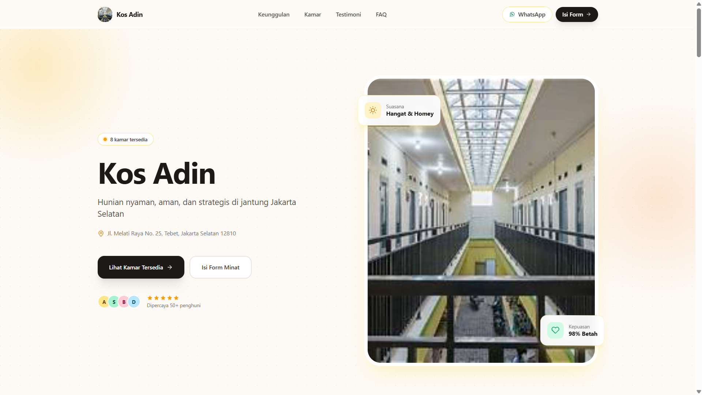
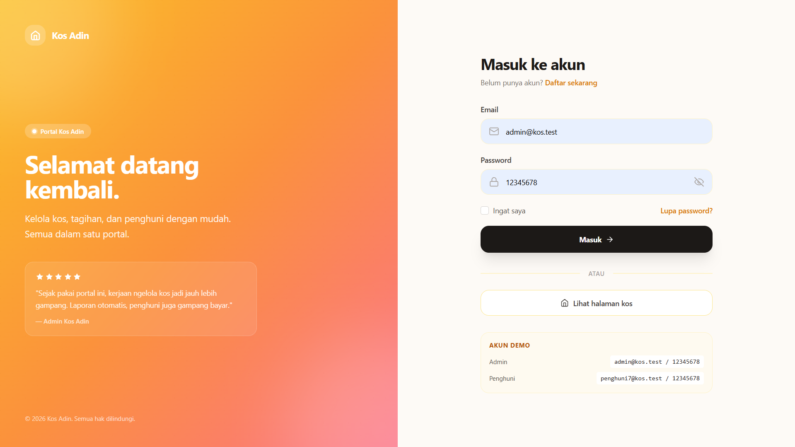
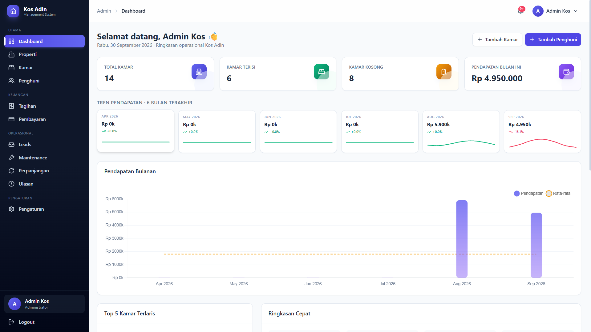
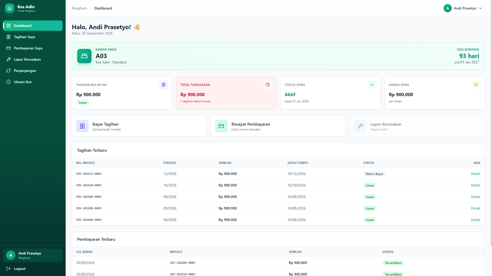

# Kos Adin - Sistem Manajemen Kos-Kosan

Sistem manajemen kos-kosan berbasis web dengan **3 role** (Admin, Penghuni, Publik) dibangun menggunakan **Laravel 13 + Tailwind CSS + Alpine.js**.


---

## 🎯 Latar Belakang

Pemilik kos sering kesulitan mengelola:
- ❌ Tagihan bulanan yang harus dibuat manual satu-satu
- ❌ Verifikasi pembayaran yang tidak terstruktur
- ❌ Pencatatan penghuni dan kamar yang masih pakai buku
- ❌ Promosi kos yang hanya dari mulut ke mulut

**Kos Adin** hadir sebagai solusi **all-in-one**:
- ✅ Pemilik kos kelola semua dari satu dashboard
- ✅ Penghuni bayar online + upload bukti transfer
- ✅ Calon penghuni lihat kamar kosong + isi form minat via **QR code**

---

## 👥 3 Role Pengguna

| Role | Akses |
|------|-------|
| **🔧 Admin** | Kelola properti, kamar, penghuni, tagihan, pembayaran, leads, maintenance, perpanjangan, ulasan, pengaturan |
| **🏠 Penghuni** | Lihat tagihan, upload bukti bayar, lapor kerusakan, ajukan perpanjangan, kasih ulasan |
| **🌐 Publik** | Lihat landing page, cek kamar kosong, isi form minat via QR |

---

## ✨ Fitur Lengkap

### 🔧 Admin Panel (11 Modul)

| # | Modul | Fitur |
|---|-------|-------|
| 1 | **Dashboard** | Statistik, chart pendapatan 6 bulan, notification bell |
| 2 | **Manajemen Properti** | CRUD properti, upload foto, multi-kos support |
| 3 | **Manajemen Kamar** | CRUD kamar, filter status, upload foto, validasi |
| 4 | **Manajemen Penghuni** | CRUD penghuni + auto-generate akun login, checkout |
| 5 | **Tagihan (Invoice)** | Generate massal otomatis, export PDF, reminder email |
| 6 | **Pembayaran** | Verifikasi, preview bukti transfer, auto-update status |
| 7 | **Leads** | List leads dari QR, convert ke penghuni (pre-filled) |
| 8 | **Maintenance** | Laporan kerusakan, update status, prioritas |
| 9 | **Perpanjangan** | Approve + auto-generate invoice |
| 10 | **Ulasan & Rating** | Moderasi ulasan, statistik rating |
| 11 | **Pengaturan** | Info kos, QR generator, rekening bank, jatuh tempo |

### 🏠 Penghuni Panel (6 Modul)

| # | Modul | Fitur |
|---|-------|-------|
| 1 | **Dashboard** | Info kamar, sisa kontrak, tagihan, tunggakan |
| 2 | **Tagihan Saya** | List tagihan, upload bukti transfer, riwayat |
| 3 | **Pembayaran Saya** | Riwayat pembayaran + status |
| 4 | **Lapor Kerusakan** | Form laporan + upload foto, riwayat |
| 5 | **Perpanjangan** | Ajukan perpanjangan sewa + preview biaya |
| 6 | **Ulasan Kos** | Rating + review (opsional anonim) |

### 🌐 Landing Page Publik

- Hero section + info kos
- Daftar kamar kosong (real-time dari database)
- Fasilitas & keunggulan
- Testimoni dari penghuni (otomatis dari ulasan approved)
- FAQ accordion
- Form minat sewa → masuk ke leads admin
- Tombol WhatsApp langsung ke pemilik

### 🔧 Fitur Teknis

- 🔐 Multi-role auth dengan middleware custom
- ⏰ Scheduler otomatis generate tagihan bulanan
- 📧 Email notification (4 template)
- 📱 QR code generator (SVG)
- 📄 Export PDF (DomPDF)
- 🖼️ Image upload dengan preview
- ⭐ Rating & review system
- 🔔 Notification bell dengan count real-time
- 📱 Responsive design (mobile, tablet, desktop)
- 🌙 Dark mode ready

---

## 🛠️ Tech Stack

| Layer | Teknologi |
|-------|-----------|
| **Backend** | Laravel 13, PHP 8.3 |
| **Database** | MySQL 8.4 |
| **Frontend** | Blade, Tailwind CSS 3, Alpine.js |
| **Auth** | Laravel Breeze |
| **PDF** | barryvdh/laravel-dompdf |
| **QR Code** | simplesoftwareio/simple-qrcode |
| **Chart** | Chart.js |
| **Build Tool** | Vite |

---

## 🚀 Cara Install

### Prasyarat
- PHP >= 8.2
- Composer
- Node.js & NPM
- MySQL

### Langkah Install

```bash
# 1. Clone repo
git clone https://github.com/Dhiyauddin0210/kos-management.git
cd kos-management

# 2. Install dependencies
composer install
npm install

# 3. Setup environment
cp .env.example .env
php artisan key:generate

# 4. Setup database (edit .env dulu)
# Bikin database: kos_management
php artisan migrate --seed

# 5. Storage link (buat upload foto)
php artisan storage:link

# 6. Build frontend
npm run build

# 7. Jalankan
php artisan serve

```

Buka `http://127.0.0.1:8000`.

---

## 🔑 Akun Demo

| Role | Email | Password |
|------|-------|----------|
| 🔧 **Admin** | `admin@kos.test` | `12345678` |
| 🏠 **Penghuni** | `penghuni3@kos.test` | `12345678` |

**Login di:** `http://127.0.0.1:8000/login`

Setelah login, otomatis redirect:
- Admin → `/admin/dashboard`
- Penghuni → `/tenant/dashboard`

---

## 🎥 Video Demo

[](https://youtu.be/gr_H8QldiKk?si=WEcBkBbLiL8u7d7E)

---

## 📸 Screenshot

### Landing Page


### Login Page


### Admin Dashboard


### Penghuni Dashboard



---

## 📊 Statistik Project

| Metrik | Nilai |
|--------|-------|
| **Fitur** | 24 fitur |
| **Role** | 3 role (Admin, Penghuni, Publik) |
| **Modul Admin** | 11 modul |
| **Modul Penghuni** | 6 modul |
| **Tabel Database** | 11 tabel |
| **File Controller** | 15+ controller |
| **File View** | 50+ view |
| **Baris Kode** | 10,000+ baris |

---

## 🎯 Yang Dipelajari

- **Laravel 13** — routing, middleware, Eloquent, Blade
- **Multi-role authentication** — middleware custom + redirect logic
- **File upload** — storage management + preview
- **Email notification** — Mail facade + 4 template
- **Scheduler** — Laravel Task Scheduling untuk generate tagihan
- **PDF generation** — DomPDF untuk laporan
- **QR code integration** — simple-qrcode untuk promosi
- **Responsive design** — Tailwind CSS mobile-first
- **Interactive UI** — Alpine.js
- **Database design** — relasi kompleks (user → tenant → room → invoice)

---

## 📁 Struktur Folder

```
kos-management/
├── app/
│   ├── Http/
│   │   ├── Controllers/
│   │   │   ├── Admin/          # 12 controller admin
│   │   │   ├── Tenant/         # 5 controller penghuni
│   │   │   └── PublicController.php
│   │   ├── Middleware/
│   │   │   ├── EnsureUserIsAdmin.php
│   │   │   └── EnsureUserIsTenant.php
│   │   └── Requests/
│   ├── Models/                 # 11 model
│   ├── Mail/                   # 4 mail class
│   └── Console/Commands/       # Scheduler
├── database/
│   ├── migrations/             # 11 migration
│   └── seeders/                # 12 seeder
├── resources/
│   └── views/
│       ├── admin/              # View admin
│       ├── tenant/             # View penghuni
│       ├── public/             # Landing page
│       ├── auth/               # Login/register
│       └── components/         # Blade components
└── routes/
    ├── web.php
    └── console.php
```

---

## 📄 Lisensi

MIT License - Bebas dipakai buat belajar & portofolio.

---

## 👨‍💻 Author

**Dhiyauddin**

- GitHub: [@Dhiyauddin0210](https://github.com/Dhiyauddin0210)
- Repo: [kos-management](https://github.com/Dhiyauddin0210/kos-management)

---

⭐ **Kalau project ini bermanfaat, kasih star di GitHub!**